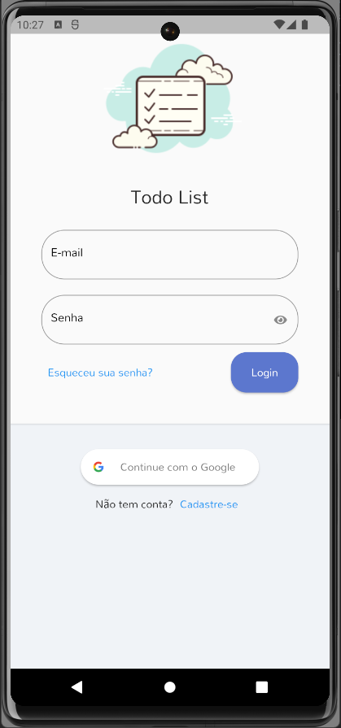
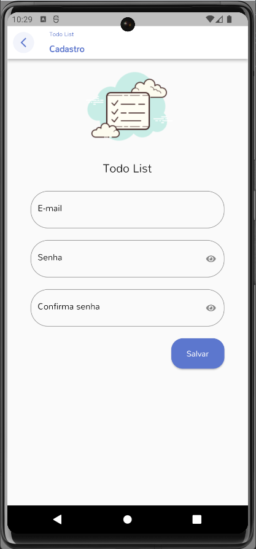

## Todo List
This is a flutter app, developed for practice.

## Technology 

Here are the technologies used in this project.

* Flutter version  3.10.0
* Dart version 3.0.0

## Techniques Used
* Modular architecture

## Services Used

* Github

## Getting started

* Dependency
  - Flutter environment   

## Pages
* Login

* Register

## Features

The main features of the application are:
 - Login.
 - Register
 

## Links
  - Repository: https://github.com/RFBruno/flutter-todo-br

  ## Versioning

  1.0.0.0

  ## Authors

  * **Bruno Rafael** 

  Please follow github and join us!
  Thanks to visiting me and good coding!
